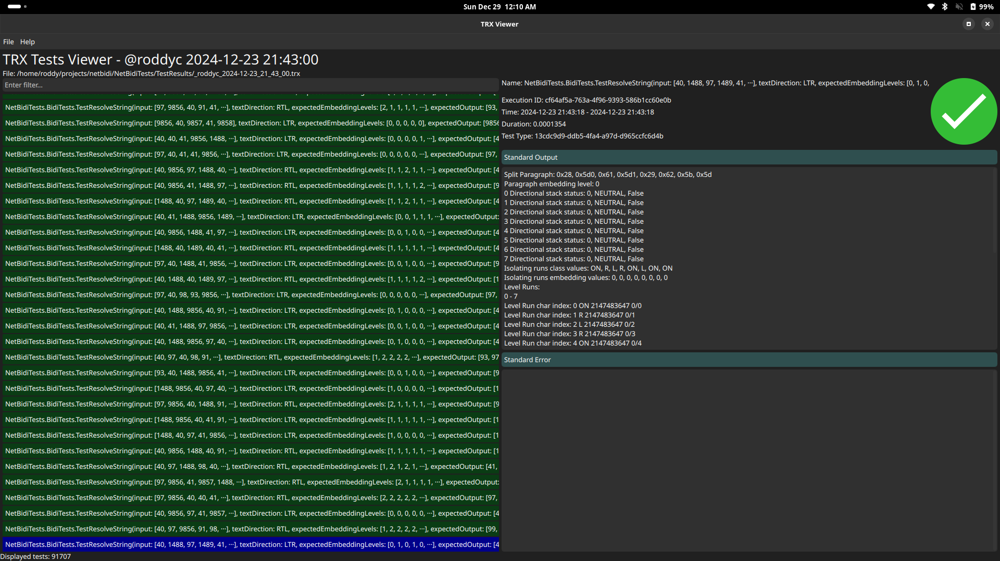
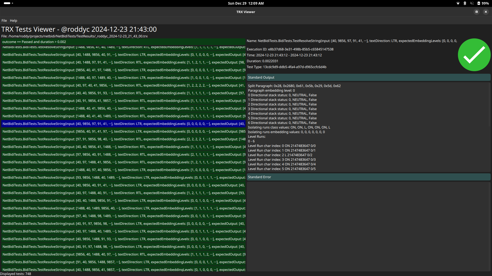
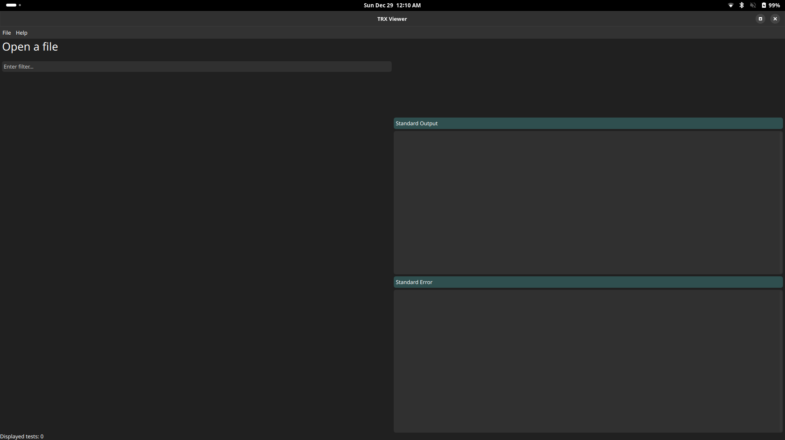
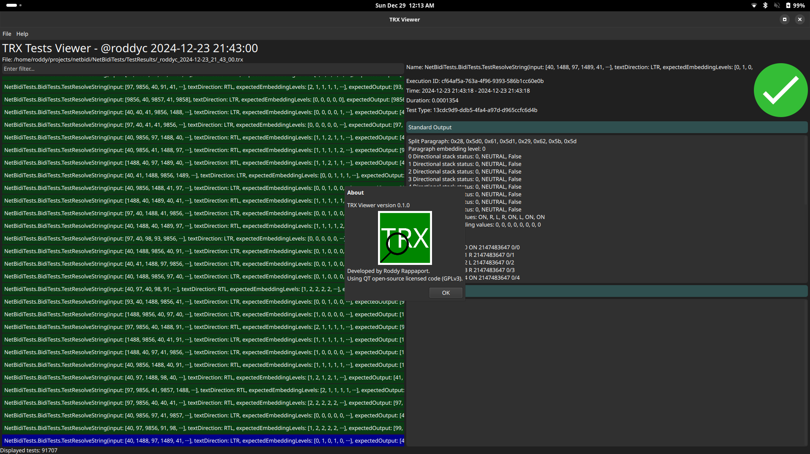

# TRX Viewer


TRX Viewer is a multi-platform software for viewing .NET test (TRX) files.
It is highly performant, and can handle TRX files with hundreds of thousands of tests.

Users can see and filter individual tests based on test parameters such as outcome and duration, and can see specific test information such as the stdout and stderr values of selected tests.

## Installation

TRX viewer is available on pip:

```bash
pipx install trx-viewer
```

Currently no standalone application launcher is provided, so simply start it from the terminal.

## Program Showcase




